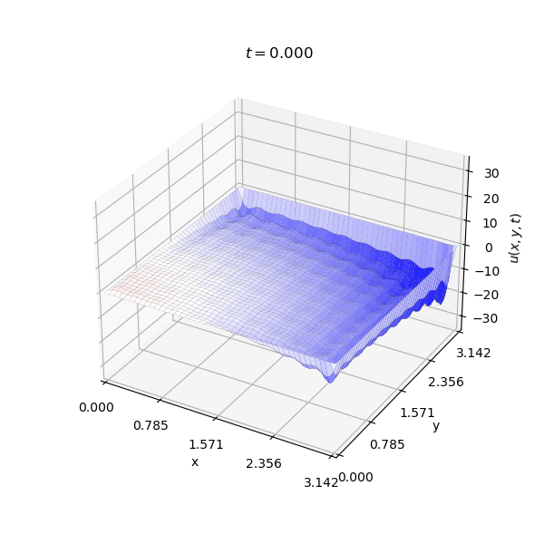

# Wave Equation Visualization
## Overview
High performance visualizer for the analytical solution of the wave equation.
## Problem
Solve the wave equation $\partial_{tt}^{2}u(x,y,t)=c^2\nabla^2u(x,y,t)$ for the initial conditions: $u(x,y,0)=1-x^2-y^2$ and $(\partial_t u)(x,y,0)=\sin{(x)}\cos{(y)}$.
## Visuals

## Usage
1. **Build and run everything:**
```bash
make
```
2. **Delete data files, frames and executables:**
```bash
make clean
```
## Technologies
* CUDA C++
* Python (Matplotlib)
* ffmpeg
* Make